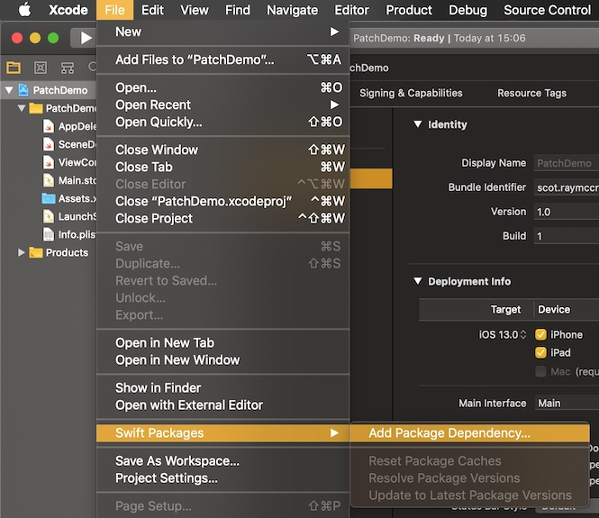
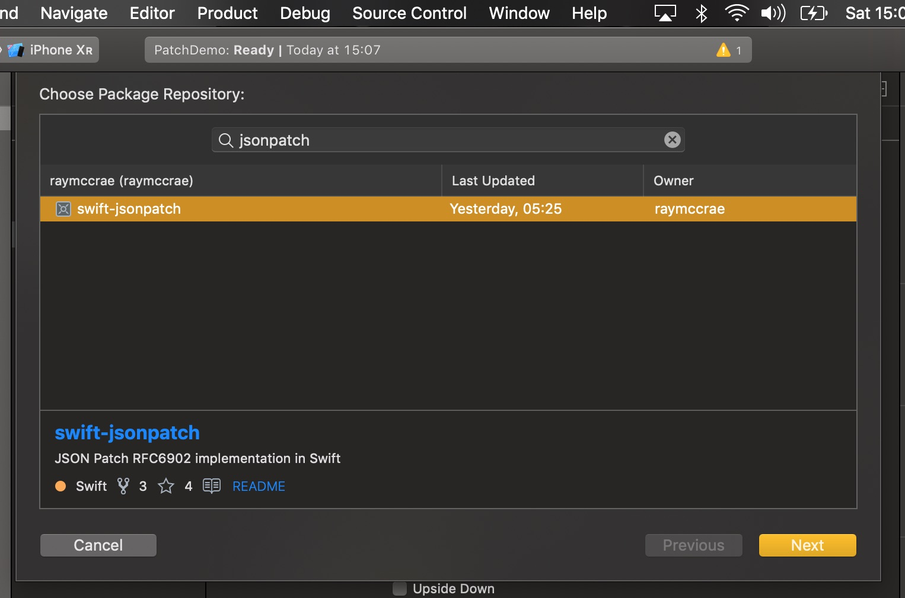
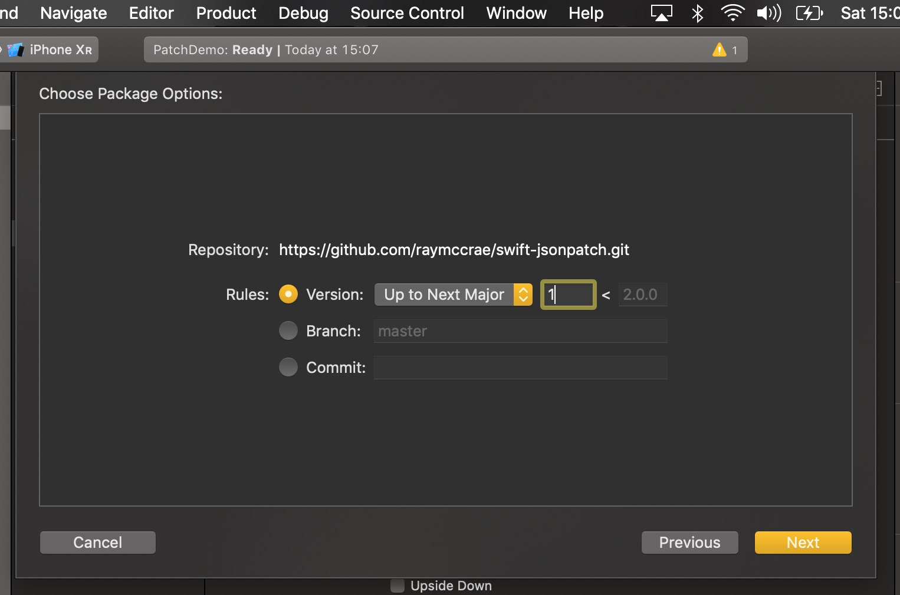
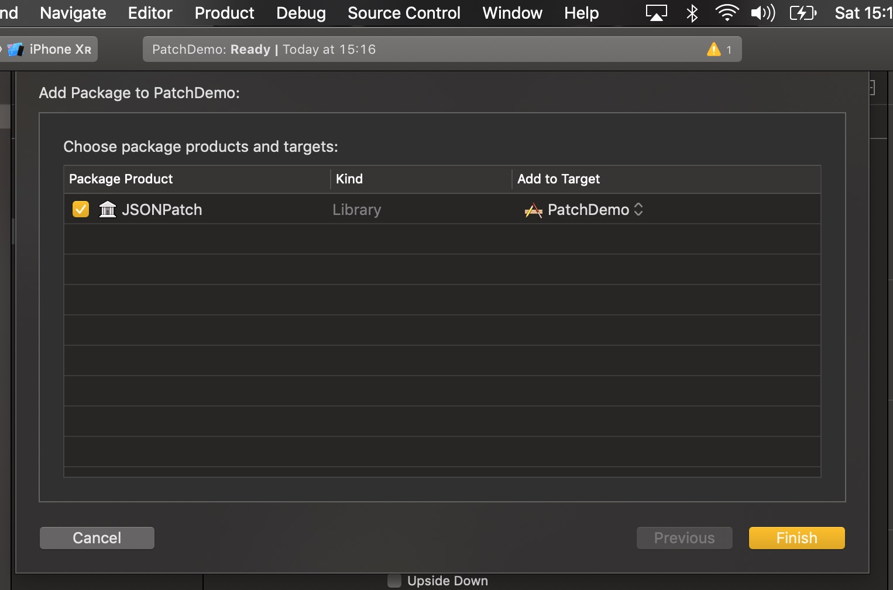

# Swift Package Manager

## Xcode 11 SPM Integration

Within the `File` menu go to `Swift Packages` -> `Add Package Dependency...`.


Search for `swift-jsonpatch`, select the repository and click the `Next` button.


Enter the version number 1 and click the `Next` button.


Click the `Finish` button.


## Manual Swift Package Manager
Add JSONPatch as a dependency to your projects Package.swift. For example: -

```swift
// swift-tools-version:4.0
import PackageDescription

let package = Package(
    name: "YourProject",
    dependencies: [
        // Dependencies declare other packages that this package depends on.
        .package(url: "https://github.com/raymccrae/swift-jsonpatch.git", .branch("master"))
    ],
    targets: [
        // Targets are the basic building blocks of a package. A target can define a module or a test suite.
        // Targets can depend on other targets in this package, and on products in packages which this package depends on.
        .target(
            name: "YourProject",
            dependencies: ["JSONPatch"]),
    ]
)
```